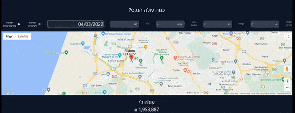

# Realestate Project

## Introduction

project including
* Crawling with selenium
* Data cleaning 
* EDA and visualization
* ML
* presentation

## Authors
* Semion Tchitchelnitski
* Ron Kopelis

# Instructions for viewing the react project.

### Fast api 
* Go to Server folder and open cmd from the url 
* Type command below and leave it open:  
  uvicorn Main:app --reload

### React webclient 
Go to house-prediction-client folder and open cmd from the url 
* Type command below and leave it open:  
  npm start
 
 
